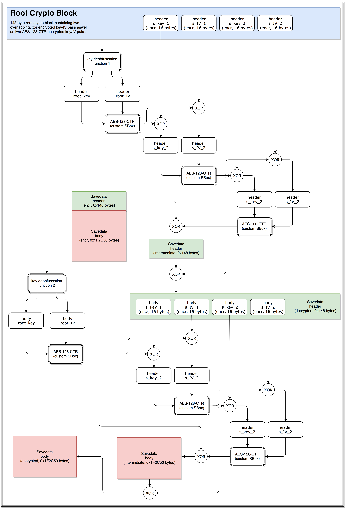

# Nioh Savedata Encryption/Decryption Tool

This tool allows the decryption and encryption of Nioh user and system save files. You can find the latest release version [here](https://github.com/pawREP/Nioh-Savedata-Decryption-Tool/releases/latest).

### How to use:
Files are encrypted and decrypted by dragging them onto the exe or equivalently by passing the file path as the first argument when using the tool in the command line. Whether encryption or decrytion is performed is automatically determined based on the first 4 bytes of the input file. Decrypted save files always start with `4E 49 4F 48`.

## Cipher overview:

Nioh uses a fairly complex algorithm to encrypt and decrypt save files. The full algorithm involves six pairs of AES-128 keys and IVs which are derived from a 148 byte chunck of memory and contents of the decryted save file header. The AES-128 cipher is used in CTR mode with a custom, non-invertible SBox. 

The diagram below illustrates the algorithm, see code for details:

### Sbox
The following SBox is used in all save file related AES calculations. Given the distribution of elements it was probably randomly generated and its non-invertibility makes the use of CTR mode mandatory.

||00|01|02|03|04|05|06|07|08|09|0A|0B|0C|0D|0E|0F|
|----|----|----|----|----|----|----|----|----|----|----|----|----|----|----|----|----|
|**00**|1C|2F|03|53|A3|01|49|DA|A6|CD|E0|8A|19|A7|04|D4|
|**01**|06|1A|DA|49|08|E2|F6|B2|9E|E1|22|49|CE|7B|7E|5E|
|**02**|A0|09|2A|63|AF|49|CE|70|7B|3C|23|80|FA|17|47|F2|
|**03**|62|62|6C|59|10|CC|29|9C|B5|46|58|C7|44|13|E7|38|
|**04**|D5|AF|27|83|D4|D5|A0|9E|E3|76|3B|85|04|D9|D6|98|
|**05**|60|66|D4|78|53|EA|CA|0E|8D|56|53|44|E2|EF|BD|A9|
|**06**|9B|10|0A|A1|13|93|F0|43|0B|7C|39|8A|47|DF|D3|C5|
|**07**|0E|34|31|A6|AE|5A|B8|E7|E6|31|43|C0|AA|0F|E0|82|
|**08**|12|4C|D1|DF|8B|A5|AC|70|C5|3D|1B|8E|93|17|4D|79|
|**09**|4E|CE|63|C4|33|0E|14|57|F0|D8|19|5B|9B|61|71|F2|
|**0A**|2B|33|7E|FD|2C|0B|B6|23|20|B9|D4|91|19|94|04|A4|
|**0B**|30|13|8A|F1|D0|05|EC|5E|AC|4A|D4|D6|A5|17|7F|F9|
|**0C**|E5|F6|00|29|D7|93|2D|5E|2C|F1|81|A3|B7|63|39|57|
|**0D**|C2|33|87|2D|A8|3F|02|CC|08|67|74|60|D8|F0|DA|67|
|**0E**|40|64|87|55|BB|7F|F2|10|C9|03|14|B5|80|66|CB|91|
|**0F**|F6|1F|79|58|88|BC|95|C2|06|5F|E9|09|32|ED|9B|85|

